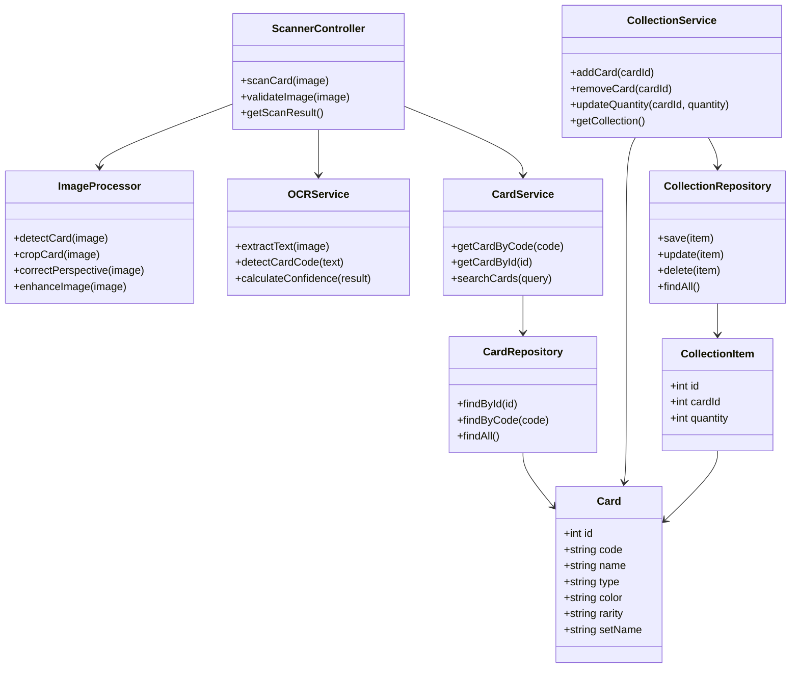
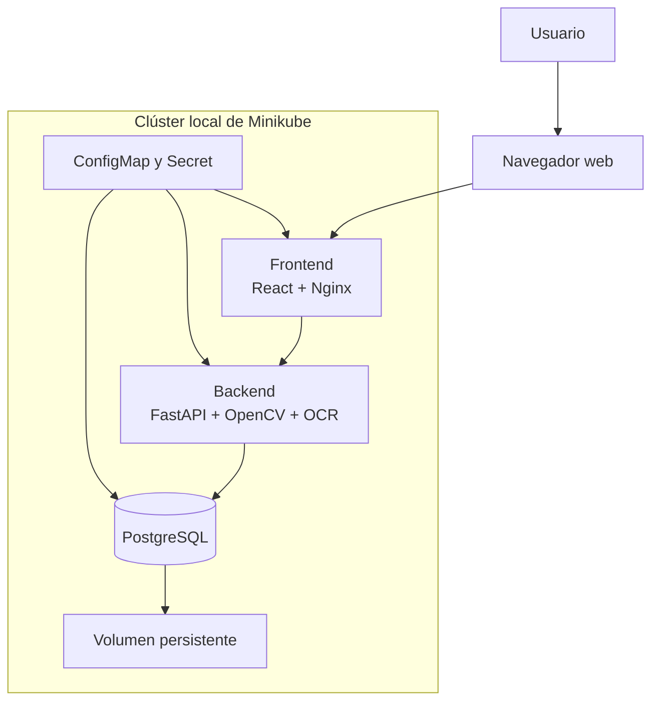
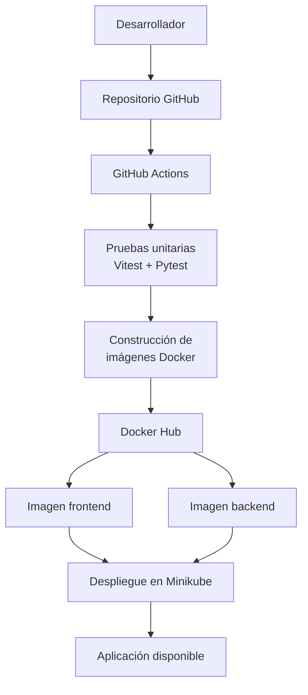
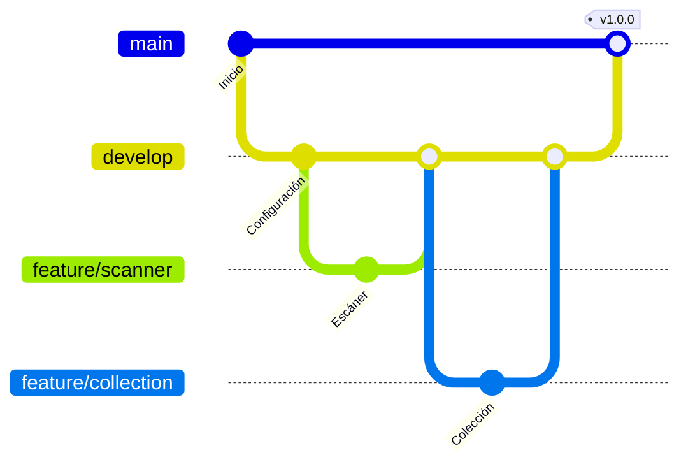

# One Piece TCG Card Scanner

## Sistema de reconocimiento y gestión de cartas coleccionables

**Autor:** Jonathan Michel Arrañaga Ramos  
**Repositorio:** https://github.com/Jonymacarroni/One-piece-tcg-scanner  
**Project Board:** https://github.com/users/Jonymacarroni/projects/1  

---

## 1. Descripción del proyecto

One Piece TCG Card Scanner será una aplicación web que permitirá identificar cartas del juego One Piece Card Game mediante una fotografía o imagen.

El sistema procesará la imagen utilizando OpenCV y extraerá el código de identificación de la carta mediante reconocimiento óptico de caracteres (OCR). Posteriormente, consultará una base de datos para mostrar información como nombre, código, tipo, color, rareza y colección.

La aplicación también permitirá que el usuario registre las cartas que posee y administre su colección personal.

---

## 2. Objetivo general

Desarrollar una aplicación web capaz de reconocer cartas de One Piece TCG mediante procesamiento de imágenes y OCR, consultar su información y permitir la administración de una colección personal.

---

## 3. Alcance del MVP

La primera versión del sistema incluirá las siguientes funciones:

- Cargar una fotografía o imagen de una carta.
- Validar el formato y tamaño de la imagen.
- Detectar y recortar la carta mediante OpenCV.
- Corregir la perspectiva y mejorar la imagen.
- Extraer el código de la carta mediante Tesseract OCR.
- Consultar la información de la carta en PostgreSQL.
- Mostrar los datos encontrados en una interfaz web.
- Agregar la carta a una colección personal.
- Modificar la cantidad de cartas almacenadas.
- Eliminar cartas de la colección.
- Ejecutar pruebas unitarias del frontend y backend.
- Ejecutar la aplicación mediante contenedores Docker.
- Desplegar localmente la aplicación mediante Minikube.

---

## 4. Componentes del sistema

### ScannerController

Recibe la imagen enviada desde la interfaz y coordina su procesamiento.

**Métodos:**

- `scanCard(image)`
- `validateImage(image)`
- `getScanResult()`

### ImageProcessor

Prepara la imagen para facilitar el reconocimiento del código.

**Métodos:**

- `detectCard(image)`
- `cropCard(image)`
- `correctPerspective(image)`
- `enhanceImage(image)`

### OCRService

Extrae y valida el código impreso en la carta.

**Métodos:**

- `extractText(image)`
- `detectCardCode(text)`
- `calculateConfidence(result)`

### CardService

Contiene la lógica para consultar la información de una carta.

**Métodos:**

- `getCardByCode(code)`
- `getCardById(id)`
- `searchCards(query)`

### CollectionService

Administra las cartas pertenecientes a la colección del usuario.

**Métodos:**

- `addCard(cardId)`
- `removeCard(cardId)`
- `updateQuantity(cardId, quantity)`
- `getCollection()`

### CardRepository

Realiza las consultas de cartas en PostgreSQL.

**Métodos:**

- `findById(id)`
- `findByCode(code)`
- `findAll()`

### CollectionRepository

Realiza las operaciones de almacenamiento de la colección.

**Métodos:**

- `save(item)`
- `update(item)`
- `delete(item)`
- `findAll()`

---

## 5. Diagrama de clases

---

## 6. Stack tecnológico

| Área | Tecnología |
|---|---|
| Frontend | React, Vite y TypeScript |
| Backend | Python y FastAPI |
| Procesamiento de imágenes | OpenCV |
| Reconocimiento de texto | Tesseract OCR |
| Base de datos | PostgreSQL |
| Pruebas del frontend | Vitest |
| Pruebas del backend | Pytest |
| Contenedores | Docker y Docker Compose |
| Registro de imágenes | Docker Hub |
| Orquestación | Kubernetes y Minikube |
| Pipeline CI/CD | GitHub Actions |
| Control de versiones | Git y GitHub |
| Gestión del proyecto | GitHub Projects |

---

## 7. Diagrama de infraestructura

La infraestructura estará formada por un clúster local de Minikube. Dentro del clúster se ejecutarán los contenedores del frontend, backend y PostgreSQL.

Los datos de PostgreSQL se almacenarán en un volumen persistente. Las variables de configuración se administrarán mediante ConfigMap y Secret.

---

## 8. Diagrama de deployment

### Proceso de deployment

1. El desarrollador realiza un push o pull request en GitHub.
2. GitHub Actions instala las dependencias.
3. Se ejecutan las pruebas unitarias del frontend y backend.
4. Se generan los reportes de cobertura.
5. Si las pruebas son exitosas, se construyen las imágenes Docker.
6. Las imágenes se publican en Docker Hub.
7. Minikube descarga las imágenes.
8. Kubernetes crea los pods y servicios de la aplicación.

---

## 9. Pruebas unitarias

El proyecto incluirá pruebas unitarias en sus dos componentes principales.

### Frontend

Se utilizará Vitest para comprobar:

- Validación del formulario de carga.
- Selección y previsualización de imágenes.
- Presentación de la información de la carta.
- Manejo de estados de carga y errores.
- Administración de la colección.

### Backend

Se utilizará Pytest para comprobar:

- Validación de imágenes.
- Detección del código de una carta.
- Consulta de cartas por código.
- Operaciones de la colección.
- Respuestas de los endpoints de la API.

GitHub Actions ejecutará automáticamente las pruebas y generará reportes de cobertura.

---

## 10. Docker Hub

El proyecto contará con dos imágenes principales:

- `one-piece-tcg-frontend`
- `one-piece-tcg-backend`

Las imágenes se etiquetarán con una versión y con la etiqueta `latest`.

Las credenciales de Docker Hub se almacenarán como secretos de GitHub y no estarán escritas directamente en el repositorio.

---

## 11. Estrategia de ramas

El proyecto utilizará una estrategia simplificada basada en GitFlow.

### Ramas utilizadas

- `main`: contiene las versiones estables.
- `develop`: integra las funciones que se encuentran en desarrollo.
- `feature/*`: se utiliza para desarrollar nuevas funcionalidades.
- `hotfix/*`: se utiliza para corregir errores urgentes de producción.

Las ramas `feature/*` se integrarán a `develop` mediante pull requests. Antes de integrar cambios, GitHub Actions ejecutará las pruebas automatizadas.

Cuando una versión sea estable, `develop` se integrará a `main`.

---

## 12. Plan de trabajo

La administración del proyecto se realizará mediante GitHub Projects utilizando las columnas:

- Todo
- In Progress
- Done

El trabajo fue dividido en los siguientes issues:

1. Definir arquitectura y alcance del MVP.
2. Configurar estructura inicial y estrategia de ramas.
3. Diseñar la base de datos de cartas y colecciones.
4. Desarrollar API REST para consulta de cartas.
5. Implementar procesamiento de imágenes con OpenCV.
6. Implementar reconocimiento del código mediante OCR.
7. Desarrollar interfaz web para escanear cartas.
8. Implementar colección personal de cartas.
9. Implementar pruebas unitarias del frontend y backend.
10. Contenerizar la aplicación con Docker.
11. Configurar pipeline CI/CD con GitHub Actions.
12. Publicar imágenes del proyecto en Docker Hub.
13. Desplegar la aplicación en Kubernetes con Minikube.
14. Documentar el proyecto y preparar la presentación final.

---

## 13. Resultado esperado

El resultado esperado es una aplicación web funcional capaz de procesar la imagen de una carta de One Piece TCG, reconocer su código, mostrar su información y permitir que el usuario la agregue a una colección personal.

El proyecto contará con pruebas automatizadas, contenedores Docker, publicación de imágenes en Docker Hub, pipeline CI/CD con GitHub Actions y un despliegue local mediante Kubernetes y Minikube.

---

## 14. Entregables

- Presentación del proyecto en formato PDF.
- Documento de la propuesta en formato Markdown.
- Propuesta publicada en la Wiki de GitHub.
- Repositorio del proyecto.
- GitHub Project Board con los issues.
- Diagramas de clases, infraestructura y deployment.